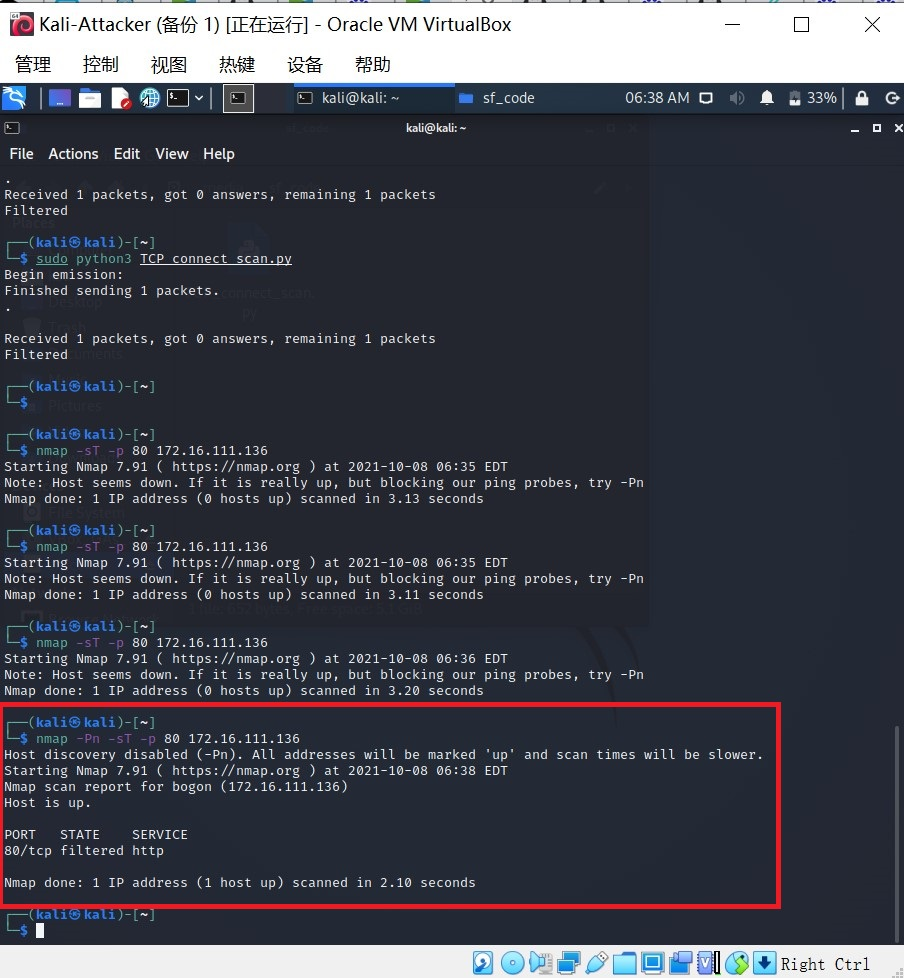
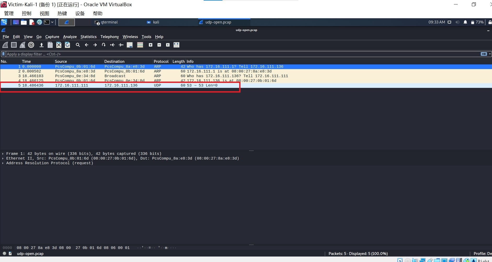
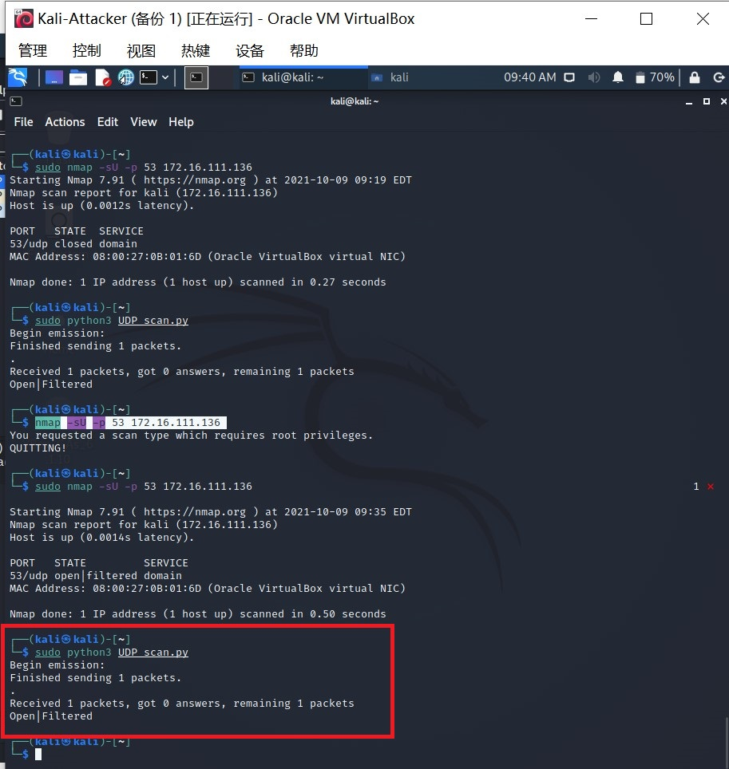

# 实验五：基于Scapy编写端口扫描器

## 一、实验目的

掌握网络扫描之端口状态探测的基本原理

## 二、实验环境

- python
- scapy
- nmap
- linux-kali

## 三、实验要求（完成度）

- [x] 禁止探测互联网上的 IP ，严格遵守网络安全相关法律法规

- [x] 完成以下扫描技术的编程实现

- [x] TCP connect scan / TCP stealth scan

- [x] TCP Xmas scan / TCP fin scan / TCP null scan

- [x] UDP scan

- [x] 上述每种扫描技术的实现测试均需要测试端口状态为：`开放`、`关闭` 和 `过滤` 状态时的程序执行结果

- [x] 提供每一次扫描测试的抓包结果并分析与课本中的扫描方法原理是否相符？如果不同，试分析原因；

- [x] 在实验报告中详细说明实验网络环境拓扑、被测试 IP 的端口状态是如何模拟的

- [x] （可选）复刻 `nmap` 的上述扫描技术实现的命令行参数开关


## 四、实验原理

### 各类扫描原理

`TCP connect scan` 与`TCP stealth scan`都是先发送一个SYN数据包到目标主机的特定端口上，如果没有回应则属处于过滤状态；如果接收到RSN/ACK数据包，端口是关闭状态；如果接收到SYN/ACK数据包，说明端口是开发状态，这时：

- `TCPconnect scan`会回复一个RST/ACK数据包，完成三次握手后断开连接
- `TCP stealth scan`只回复一个RST，不完成三次握手，直接取消建立连接


`TCP Xmas scan`、`TCP fin scan` 和`TCP null scan`都属于隐蔽扫描，他们的优点是隐蔽性比较好，缺点是需要自己构造数据包，要求有超级用户或者授权用户权限。

他们都是先发送一个包，端口关闭则回复RST，端口开放或过滤则没有任何相应。其中：

- `TCP Xmas scan`发的是TCP包，并对TCP报文头FIN\URG和PUSH进行设置。
- `TCP fin scan`发的是FIN包
- `TCP null scan`发送TCP数据包，关闭所有TCP报文头标记


UDP是无连接的协议，通过发送UDP+port得到靶机状态

- 如果收到一个 ICMP 不可到达的回应，那么则认为这个端口是关闭的
- 对于没有回应的端口则认为是开放的
- 如果目标主机安装有防火墙或其它可以过滤数据包的软硬件,那我们发出 UDP 数据包后,将可能得不到任何回应。


### scapy原理

```
# 导入模块
from scapy.all import *
# 查看包信息
pkt = IP(dst="")
ls(pkt)
pkt.show()
summary(pkt)
# 发送数据包
send(pkt)  # 发送第三层数据包，但不会受到返回的结果。
sr(pkt)  # 发送第三层数据包，返回两个结果，分别是接收到响应的数据包和未收到响应的数据包。
sr1(pkt)  # 发送第三层数据包，仅仅返回接收到响应的数据包。
sendp(pkt)  # 发送第二层数据包。
srp(pkt)  # 发送第二层数据包，并等待响应。
srp1(pkt)  # 发送第二层数据包，并返回响应的数据包
# 监听网卡
sniff(iface="wlan1",count=100,filter="tcp")
# 应用：简单的SYN端口扫描 （测试中）
pkt = IP("...")/TCP(dport=[n for n in range(22, 3389)], flags="S")
ans, uans = sr(pkt)
ans.summary() # flag为SA表示开放，RA表示关闭
```


## 五、实验过程

### 网络拓扑


- 扫描端(Kali-Attacker):

  08:00:27:0e:34:8d/eth0

  172.16.111.111

  

- 靶机(Victim-Kali-1)：

  08:00:27:0b:01:6d/eth0

  172.16.111.136
  
  
  
- 网关（Gateway）

  09:00:27:8a:e8:3d/enp0s9

  172.16.111.1


### 端口状态模拟

- 关闭状态：对应端口没有开启监听，防火墙没有开启

  ```
  ufw disable #关闭防火墙
  systemctl stop apache2 #关闭端口80
  systemctl stop dnsmasq #关闭端口53
  ```

- 开启状态：对应端口开启监听，apache2基于TCP，在80端口提供服务；DNS服务基于UDP，在53端口提供服务。防火墙处于关闭状态

  ```
  systemctl start apache2 #port80
  systemctl start dnsmasq #port53
  ```

- 过滤状态：对应端口开启监听，防火墙开启。

  ```
  ufw enable #开启防火墙
  ufw deny 80/tcp #开启80端口监听
  ufw deny 53/udp #开启53端口监听
  ```


### 初始状态检查

首先检查nmap


接下来查看靶机初始状态


看到端口处于关闭状态。


### TCP connect scan

- #### closed

  python编程

  

  

  靶机抓包

  

  TCP connect scan时，攻击者主机接收到的是RST/ACK数据包，说明端口是关闭的。

  

  
  
  复刻nmap
  
  


- #### open

  `systemctl start apache2`开启基于tcp的apache2服务

  

  

  python编程

  

  

  靶机抓包

  

  TCP connect scan时，攻击者主机接收到SYN/ACK数据包，说明端口是开放状态。最后攻击者发送RST和ACK报文，在完成三次握手的同时断开连接。

  

  

  复刻nmap

  

  

  

- #### filtered

  

  

  python编程：

  

  

  

  靶机抓包：

  

  TCP connect scan时，靶机没有任何响应，意味着端口处于过滤状态。

  

  

  复刻nmap：
  
  
  
  


### TCP stealth scan

- #### closed

  

  

  python编程：

  

  

  靶机抓包：

  

  TCP stealth scan时，攻击者主机接收到的是RST/ACK数据包，说明端口是关闭的。

  

  
  
  nmap复刻：
  
  


- #### open

  python编程：

  

  

  靶机抓包：

  

  TCP stealth scan时，攻击者主机接收到SYN/ACK数据包，说明端口是开放状态。最后攻击者发送RST报文，不完成三次握手，直接取消连接。

  

  

  nmap复刻：

  

  

  

- #### filtered

  python编程：

  

  

  靶机抓包：

  

  TCP stealth scan时，靶机没有任何响应，意味着端口处于过滤状态。

  

  

  

  nmap复刻：
  
  
  
  
  
  

### TCP Xmas scan 

- #### closed

  python编程：

  

  

  靶机抓包：

  

  可以看到端口关闭时，靶机回复RST数据包

  

  nmap复刻：

  

  

  

- #### open

  python编程：

  

  

  靶机抓包：

  

  可以看到端口开放时，靶机不做出响应。

  

  nmap复刻：

  

  

- #### filtered

  python编程：

  

  

  靶机抓包：

  

  可以看到端口过滤时，靶机不做出响应

  

  

  nmap复刻：
  
  

### TCP fin scan 

- #### closed

  python编程：

  

  

  靶机抓包：

  

  

  可以看到端口关闭时，靶机回复RST数据包

  

  

  nmap复刻：

  

  

- #### open

  python编程：

  

  

  靶机抓包：

  

  可以看到端口开放时，靶机不做出响应。

  

  nmap复刻：

  

  

- #### filtered

  python编程：

  

  

  靶机抓包：

  

  

  可以看到端口过滤时，靶机不做出响应。

  

  nmap复刻：

  

### TCP null scan

- #### closed

  python编程：

  

  

  靶机抓包：

  

  可以看到端口关闭时，靶机回复RST数据包。

  

  nmap复刻：

  

  

- #### open

  python编程：

  

  

  靶机抓包：

  

  

  可以看到端口开放时，靶机不做出响应。

  

  nmap复刻：

  

  

- #### filtered

  python编程：

  

  

  靶机抓包：

  

  

  可以看到端口过滤时，靶机不做出响应。

  

  nmap复刻：

  

### UDP scan

- #### closed

  python编程：

  

  

  靶机抓包：

  

  在UDP scan时，可以看到当端口关闭时，攻击主机得到ICMP不可达的回应。

  

  

  nmap复刻：

  

  

- #### open

  python编程：

  

  

  

  靶机抓包：

  

  在UDP scan时，当端口开放时，靶机不给与回应。

  

  

  nmap复刻：

  

  

- #### filtered

  python编程：

  

  

  靶机抓包：

  

  在UDP scan时，处于过滤状态时，靶机不给回应。

  

  

  nmap复刻：

  


提供每一次扫描测试的抓包结果并分析与课本中的扫描方法原理是否相符？如果不同，试分析原因；

每一次扫描测试的抓包结果如上述实验过程所述。从上述实验结果可知，每一次扫描测试的抓包结果与课本中的扫描方法原理相符。

## 六、问题及解决方法

在Kali-Attacker设置文件共享时候，发现共享文件夹不能访问

可以通过修改 /etc/group上的权限进行访问


## 七、参考资料

- [scapy入门指南](https://blog.csdn.net/lemon_tree12138/article/details/51141440)
- [nmap使用指南](https://zhuanlan.zhihu.com/p/99356105)
- [第五章课件](https://c4pr1c3.github.io/cuc-ns/chap0x05/main.html)
- [自己动手编程实现并讲解TCP connect scan/TCP stealth scan/TCP XMAS scan/UDP scan](https://blog.csdn.net/jackcily/article/details/83117884)
- [CUCCS/2020-ns-public-LyuLumos](https://github.com/CUCCS/2020-ns-public-LyuLumos/tree/ch0x05/ch0x05#%E5%AE%9E%E9%AA%8C%E5%8E%9F%E7%90%86)
